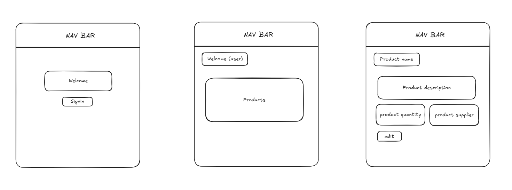

# Shelfiy — Inventory Management Made Simple
Shelfiy is a modern inventory management app built on the MERN stack, designed to help businesses track products, suppliers, and stock levels with clarity and control. It features:
- Role-based access control: Admins have full CRUD access, while managers can only edit — ensuring secure, permission-aware workflows.
- Global and scoped indexes: Products and suppliers are listed in clean, unified views, with intuitive navigation between index and form pages.
- Robust backend architecture: Express routes are flat and predictable, with centralized error handling and modular controller logic.
- User-friendly frontend: React components are structured for clarity, with scoped feedback, clean exports, and seamless integration with backend services.
- Scalable design: Shelfiy is built for maintainability, with thoughtful separation of concerns and consistent code conventions across the stack.
Whether you're managing a warehouse or a small shop, Shelfiy gives you the tools to stay organized, secure, and efficient.

Link to backend: https://github.com/hawramohamed/Shelfiy-Backend

# Technologies used

- MongoDB
- Mongoose
- Express.js
- React.js
- Node.js
- CSS

# Future Plan
- Integration with external services: Connect to accounting tools (like QuickBooks) or e‑commerce platforms.

 - Notifications & alerts: Low‑stock alerts, supplier reminders, and role‑based notifications

- Dashboard analytics: Visualize stock levels, supplier activity, and product performance with charts.

# User Stories

- As an admin, I want to add new products with details (name, category, price, stock quantity, supplier) so that inventory records remain accurate.
- As an admin, I want to edit and delete products so that outdated or incorrect items are removed from the system.
- As an admin, I want to link products to suppliers so that I can track where each item comes from.
- As an admin, I want to add supplier details (name, contact info, address) so that vendor information is stored for future reference.
- As an admin, I want to view all products provided by a supplier so that I can evaluate supplier performance.
- As a staff user, I want to update product stock quantities after sales or restocking so that inventory levels stay current.
- As a staff user, I want to search and filter products so that I can quickly find items in the catalog.
- As a staff user, I want to view supplier details linked to products so that I know who provides each item.
- As a staff user, I want to update supplier contact information so that communication with vendors remains accurate.

## ERD

## WireFrames

