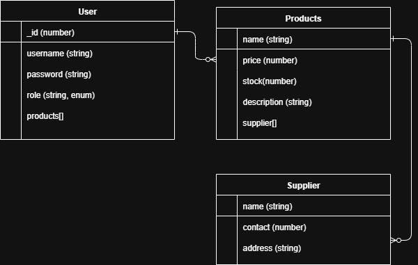

# User Stories

- As an admin, I want to add new products with details (name, category, price, stock quantity, supplier) so that inventory records remain accurate.
- As an admin, I want to edit and delete products so that outdated or incorrect items are removed from the system.
- As an admin, I want to link products to suppliers so that I can track where each item comes from.
- As an admin, I want to add supplier details (name, contact info, address) so that vendor information is stored for future reference.
- As an admin, I want to view all products provided by a supplier so that I can evaluate supplier performance.
- As a staff user, I want to update product stock quantities after sales or restocking so that inventory levels stay current.
- As a staff user, I want to search and filter products so that I can quickly find items in the catalog.
- As a staff user, I want to view supplier details linked to products so that I know who provides each item.
- As a staff user, I want to update supplier contact information so that communication with vendors remains accurate.

## ERD

## WireFrames

